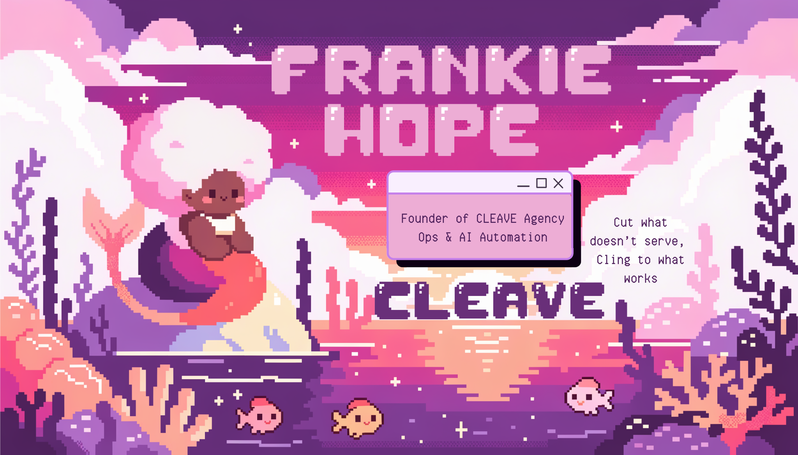
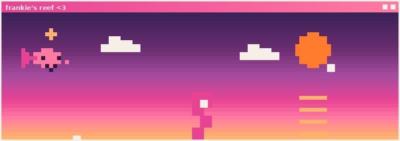
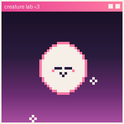
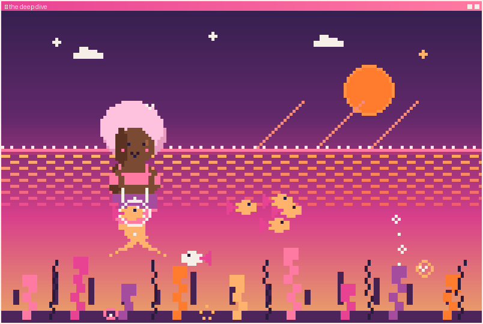

<!--
  🎨 Banner: assets/banner.png — Higgsfield art (job 2d5845f9) with name + title
  added in Canva by Frankie. To update it: edit in Canva, export as PNG, and
  replace assets/banner.png (keep it roughly 16:9 / under ~2 MB). The clean
  text-free art is preserved at assets/.banner_raw.png (gitignored).
-->

  

---

<h2 align="center">🌊 Howdy, I'm Frankie!</h2>

<b>TL;DR:</b> 
🔥 Spent 10+ yrs putting out Fortune 500 project fires (Southwest, GameStop, Harley-Davidson) 
🤖 Now I build AI automation for small businesses that were told they're too small to afford it 
🧜🏾‍♀️ Founder of CLEAVE · architect of CLARA · one-woman agency run entirely on tools I built 
✨ Vibe-coder, systems designer, shameless Claude superfan

For over a decade I was the person Fortune 500 companies called when their projects were quietly on fire. I climbed through the SDLC doing enterprise process improvement and Agile delivery — a decade-long master class in how giant companies achieve operational efficiency. The thing nobody says out loud: small businesses need the exact same thing, they just can't afford the consultants, software, or overhead. AI changed that math. So I left to do something about it.

That's CLEAVE — enterprise-grade operations and AI automation for businesses that were told they were too small to have them. I embed in a business, hunt down the repetitive work bleeding its time and money, and replace it with custom AI agents. Underneath runs CLARA, my framework for persistent, auditable, cost-efficient agent systems — Fortune 500-grade automation, fast and cheap. Next up: productizing the greatest hits (lead capture, grant writing, ops workflows) into repeatable tools.

Heard of vibe coding? I'm not a traditional software engineer — I architect the system, make the design calls, and direct the build end to end. CLARA is the proof: it fixes the three things that quietly break most AI deployments (goldfish-memory sessions, bloated context, over-permissioned AI) and drops session-start cost from ~30,000–42,000 tokens to roughly 800 — no server, no database, no subscription beyond the LLM. I built it to run CLEAVE. It runs CLEAVE.

Some of this profile is serious infrastructure. Some of it is a mermaid. Both are on purpose. 🧜🏾‍♀️

---

<h2 align="center">🪸 The Reef</h2>

🪸 <i>This reef grows when I ship. Last tide: 2026-07-21 · this is reef #2.</i> · <a href="scrapbook/SCRAPBOOK.md#reefs">see past reefs 📖</a>

---

<h2 align="center">🐚 Find Me</h2>

  
  
  
  
  

📍 Coastal Bend, Texas · open to SMB & nonprofit work

---

<h2 align="center">🍾 Message in a Bottle</h2>

<table><tr><td width="72"></td><td><b>2 bottles tossed into the sea so far</b> <a href="https://github.com/frankiehope333-ctrl/frankiehope333-ctrl/issues/new?title=bottle%7Cadd&body=Write%20your%20one-line%20message%20below%20this%20line%20%28~80%20chars%29%2C%20then%20submit.%20It%27ll%20bob%20onto%20Frankie%27s%20profile.%0A%0A">🍾 Toss a bottle into the sea</a> · <a href="scrapbook/SCRAPBOOK.md">open the scrapbook 📖</a></td></tr></table>

🍾 <i>"What’s in this bottle? a note for you!"</i> — @jessicaghope-byte, 2026-06-19

🍾 <i>"Hey beautiful!"</i> — @jessicaghope-byte, 2026-06-19

---

<h2 align="center">⚙️ What I'm Building</h2>

🎬 **CLEAVE Content Engine** — a structured AI content pipeline with a single
human approval gate, so output stays on-brand without a human babysitting every step.

🧲 **Lead-gen widget service** — an embeddable, multi-tenant widget for Coastal
Bend SMBs to capture and qualify leads without a marketing team.

📦 **Productized offers** — Ops Leak Audit · BPMN Kit · SOP Starter · AI Workbook.
Fixed-scope, fixed-price ways to start.

<!-- TODO: confirm — link each project to its repo/one-pager when public. -->

---

<h2 align="center">🐠 The Creature Lab</h2>

Help me build a sea creature — <b>vote one feature each visit</b> and the community assembles it together, one round at a time (body → tail → color → eyes → accessory). When it's finished it swims off into the <a href="scrapbook/SCRAPBOOK.md#creatures">scrapbook</a> and a fresh one hatches.

---

<h2 align="center">🐠 Community Creature</h2>

<b>This round we're picking the <code>body</code></b> (round 1 of 5). Vote one feature per visit:

[🗳️ seahorse — 1 votes ·lead](https://github.com/frankiehope333-ctrl/frankiehope333-ctrl/issues/new?title=creature%7Cvote%7Cbody%7Cseahorse) · [🗳️ jellyfish — 1 votes](https://github.com/frankiehope333-ctrl/frankiehope333-ctrl/issues/new?title=creature%7Cvote%7Cbody%7Cjellyfish) · [🗳️ eel — 0 votes](https://github.com/frankiehope333-ctrl/frankiehope333-ctrl/issues/new?title=creature%7Cvote%7Cbody%7Ceel)

🐠 [the menagerie 📖](scrapbook/SCRAPBOOK.md#creatures) fills up as creatures finish

---

<h2 align="center">📊 By the Numbers</h2>

<!-- These cards pull REAL data from GitHub automatically — no invented numbers.
     bg_color uses the gradient form "angle,color,color,color" (purple→pink→coral). -->

  
  

  

<!--
  🔢 CLEAVE IMPACT NUMBERS — intentionally left blank.
  BUILD.md §4: dashboard numbers must be REAL or removed, never invented.
  Fill these in with your actual figures, then uncomment the block to publish it.
  (The mockup's 12 / 40+ / 900h / $1M+ were placeholders — do NOT ship them as-is.)

  | Clients served | Automations shipped | Hours saved | Client savings |
  |:---:|:---:|:---:|:---:|
  | TODO | TODO | TODO | TODO |
-->

---

<h2 align="center">🌙 The Deep Dive — An Interactive Story</h2>

<i>🌅 The surface. Peach light on the water. Marlowe floats with the day's catch.</i>

<b>Marlowe</b> has swum the same reef for years, hauling her catch by hand — tired but proud. A glint catches her eye far below. And a stream of bubbles she doesn't recognize… someone else is down here.

<b>What does she do?</b>

🌊 <a href="sections/adventure/deep.md"><b>Dive for the glint</b></a> — she's never needed help before 
🫧 <a href="sections/adventure/meet.md"><b>Investigate the bubbles</b></a> — who else swims this deep? 
🌀 <a href="sections/adventure/ending-driftaway.md"><b>Just do your rounds, like always</b></a> — the reef is enough

↳ a love story + a quiet lesson about letting the right systems carry you · 4 endings · ~5 min

---

🌊 This profile is alive — the reef grows from my commits, the bottle wall and creature are built by visitors like you. Last assembled 2026-07-21 UTC · generated by <code>build_readme.py</code>, never hand-edited.

