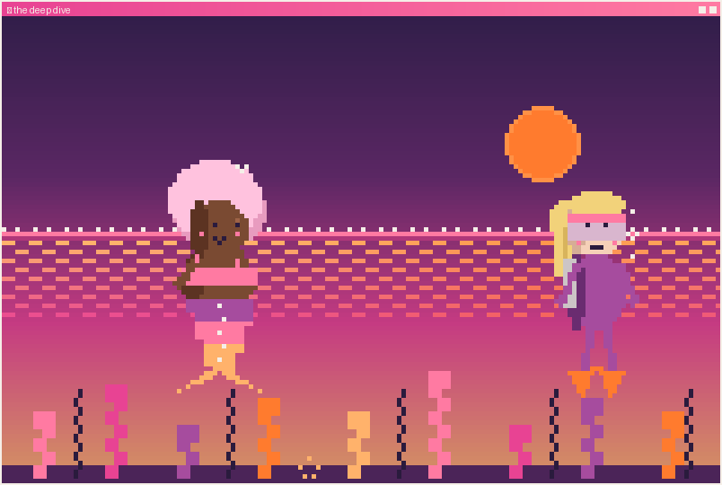

<h1 align="center">🌙 the deep dive · <i>I work alone</i></h1>

<i>🌀 The same reef. The same rounds. Familiar, and a little heavier today.</i>

She waves Cass off, proud, and does her rounds the way she always has. But she keeps thinking about how <i>effortlessly</i> that diver moved down there — no fighting the water, just gear that fit and a body that trusted it.

Here's the honest beat: watching someone with the right tools makes you wonder why you're still doing it the hard way.

<b>What does Marlowe do?</b>

🔁 <a href="together.md"><b>Go find her again</b></a> — maybe it's not weakness to ask 
🌊 <a href="deep.md"><b>Dive solo anyway</b></a> — she's come this far on her own

---

↩ <a href="../../README.md">back to the start</a>

