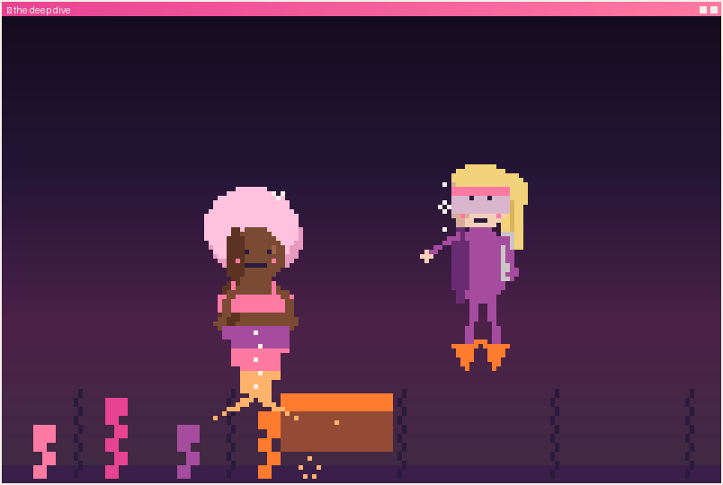

<h1 align="center">🌙 the deep dive · <i>alone at the chest</i></h1>

<i>🌑 The chest, finally. And the lid won't give.</i>

She struggles down solo, exhausted, and barely reaches the chest — but she can't lift the lid. Her arms are done. Cass hovers nearby, not taking over, not making it a thing. Just <i>there</i>. Offering a hand.

<b>What does Marlowe do?</b>

🤝 <a href="together.md"><b>Take her hand</b></a> — let someone share the weight 
💪 <a href="ending-tired.md"><b>Force it open alone</b></a> — she didn't come this far to be carried

---

↩ <a href="../../README.md">back to the start</a>

