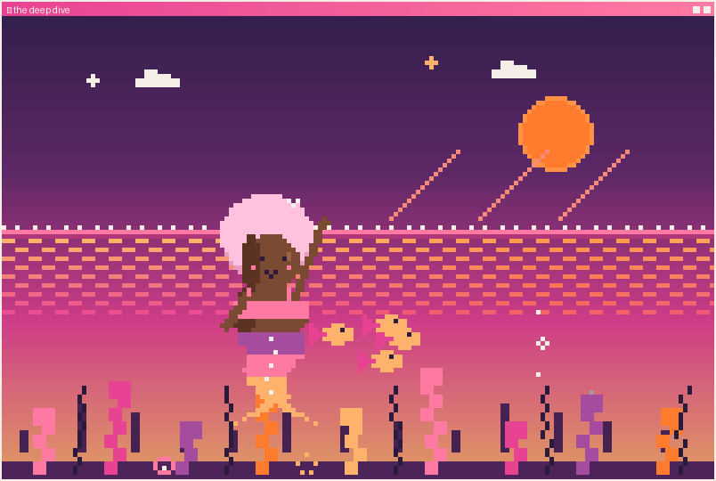

<h1 align="center">🌙 the deep dive · <i>the same reef, forever</i></h1>

<i>🌅 The same currents. The same rounds. Nothing lost, and nothing gained.</i>

She doesn't dive. She doesn't follow the bubbles. She does her rounds, the way she always has — and the reef stays exactly the same forever.

Comfortable. Small. The glint fades. The bubbles move on without her.

It's a fine life. It's just the only one she'll ever have, down here, doing it all by hand.

---

🌙 <i>Marlowe's story is a little like running a business. You can swim every current by hand, alone — or you can let the right tools (and the right people) carry what's been wearing you out, and finally reach the thing you've been swimming toward.</i>

<i>That's the work I do at <a href="https://www.cleaveagency.com">CLEAVE</a> — cutting what doesn't serve, keeping what works. Thanks for swimming with me. 🐚</i>

↩ <a href="../../README.md">back to the profile</a> · 🔁 <a href="../../README.md">swim it again?</a>

