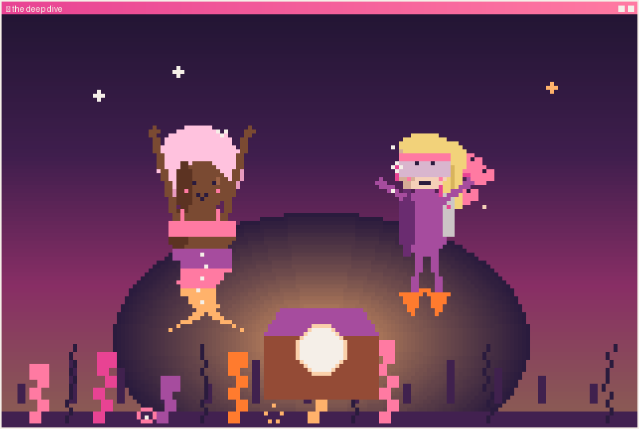

<h1 align="center">🌙 the deep dive · <i>the pearl</i> 🪙</h1>

<i>🌅 Warm light, this deep. The lid lifts easy with two sets of hands.</i>

The chest opens: one luminous pearl.

And the lesson lands light — the treasure was never about swimming harder. It was letting the right help (and the right person) carry what she'd been dragging alone. Cass grins; Marlowe grins back. Something starts between them, easy as the current.

She finally has room to grow — and someone to grow with.

---

🌙 <i>Marlowe's story is a little like running a business. You can swim every current by hand, alone — or you can let the right tools (and the right people) carry what's been wearing you out, and finally reach the thing you've been swimming toward.</i>

<i>That's the work I do at <a href="#">CLEAVE</a> — cutting what doesn't serve, keeping what works. Thanks for swimming with me. 🐚</i>

<!-- TODO: confirm — point the CLEAVE link at cleave.consulting when live. -->

↩ <a href="../../README.md">back to the profile</a> · 🔁 <a href="../../README.md">swim it again?</a>

