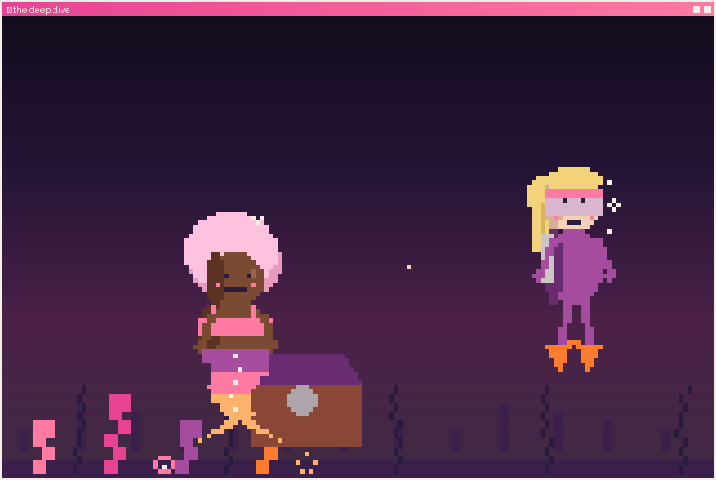

<h1 align="center">🌙 the deep dive · <i>the long way down</i> 🪙</h1>

<i>🌑 She gets it open. Alone. And she's too worn out to enjoy it.</i>

The lid finally gives. One pearl, shining — a little sadly, in the dark.

Cass drifts off; the timing was never right, because Marlowe wouldn't let it be. She got the treasure. She just paid for it with everything she had left.

<i>There was an easier way down — and better company.</i>

---

🌙 <i>Marlowe's story is a little like running a business. You can swim every current by hand, alone — or you can let the right tools (and the right people) carry what's been wearing you out, and finally reach the thing you've been swimming toward.</i>

<i>That's the work I do at <a href="https://www.cleaveagency.com">CLEAVE</a> — cutting what doesn't serve, keeping what works. Thanks for swimming with me. 🐚</i>

↩ <a href="../../README.md">back to the profile</a> · 🔁 <a href="../../README.md">swim it again?</a>

